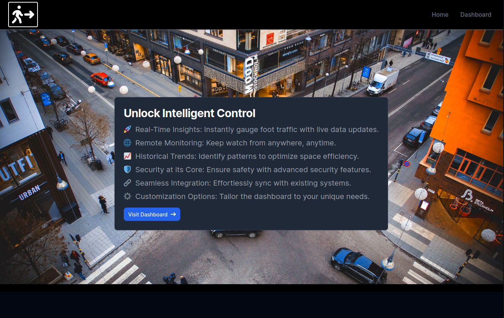

# f23-final-project-tomlkeate
Final project for CS4990 Embedded Systems
A ESP32 arduino board with two lidars used to track people entering and leaving a room.
A web app to see the data is also supplied.

# foot-tracker
# foot-tracker
